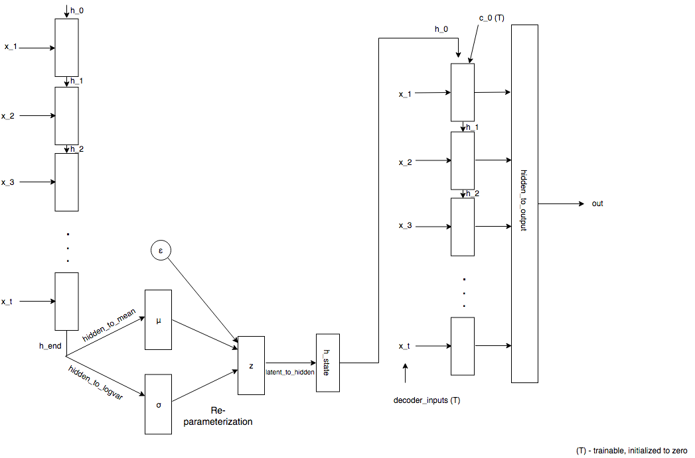
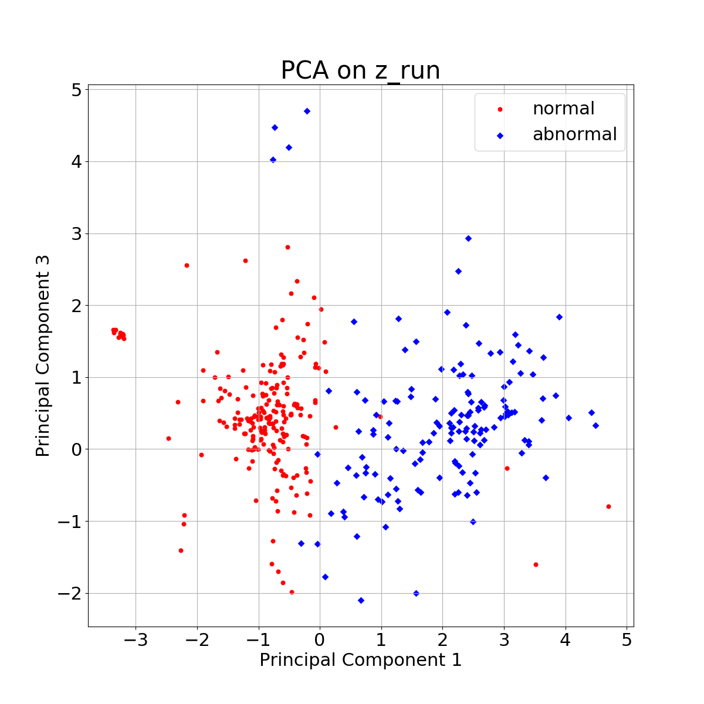
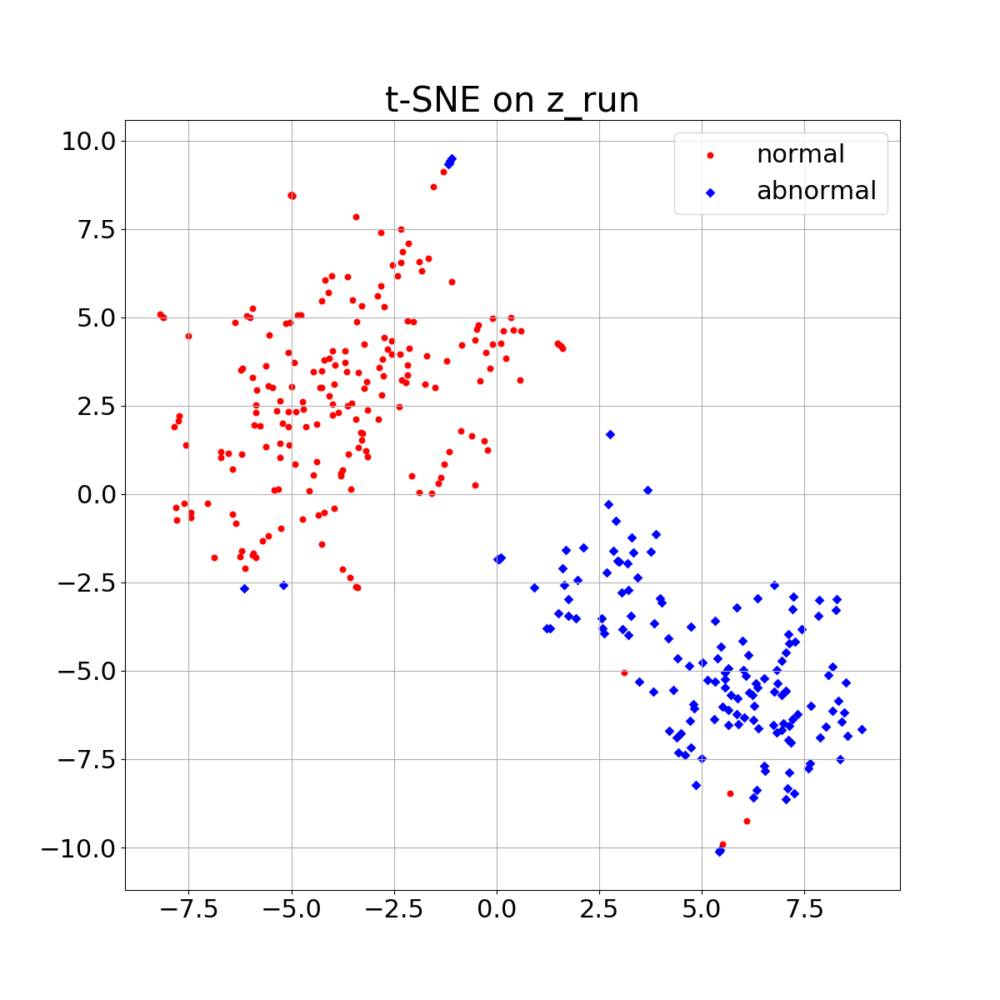
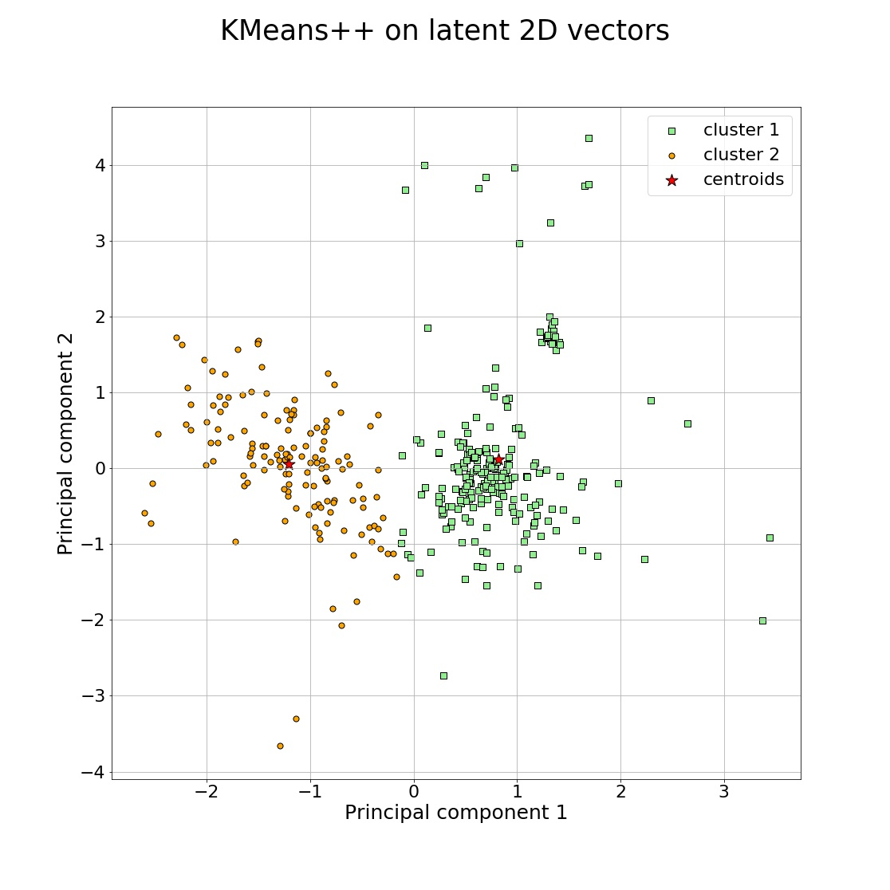
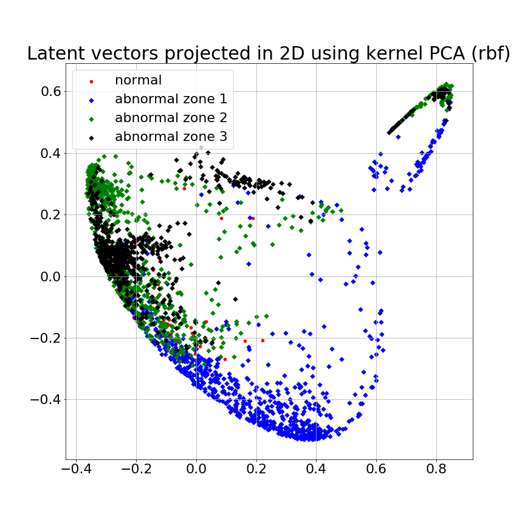
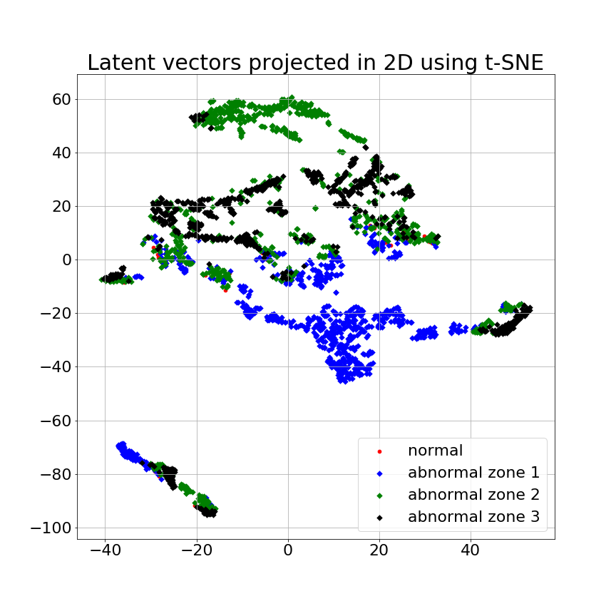

# Wind-Turbine-Anomaly-Detection-VRAE

Paper: [Anomaly Detection of Wind Turbine Time Series using Variational Recurrent Autoencoders.](https://arxiv.org/abs/2112.02468)

## Abstract

Ice accumulation in the blades of wind turbines can
cause them to describe anomalous rotations or no rotations at all,
thus affecting the generation of electricity and power output. In
this work, we investigate the problem of ice accumulation in wind
turbines by framing it as anomaly detection of multi-variate time
series. Our approach focuses on two main parts: first, learning
low-dimensional representations of time series using a Variational
Recurrent Autoencoder (VRAE), and second, using unsupervised
clustering algorithms to classify the learned representations as
normal (no ice accumulated) or abnormal (ice accumulated).
We have evaluated our approach on a custom wind turbine
time series dataset, for the two-classes problem (one normal
versus one abnormal class), we obtained a classification accuracy
of up to 96% on test data. For the multiple-class problem
(one normal versus multiple abnormal classes), we present a
qualitative analysis of the low-dimensional learned latent space,
providing insights into the capacities of our approach to tackle
such problem. The code to reproduce this work can be found
here https://github.com/agrija9/Wind-Turbine-Anomaly-Detection-VRAE.


## Installation Requirements

1) [Install Anaconda](https://www.digitalocean.com/community/tutorials/how-to-install-anaconda-on-ubuntu-18-04-quickstart) and create an environment in your system.

2) Install the following dependencies in your anaconda environment

	* NumPy (>= 1.19.2)
	* Matplotlib (>= 3.3.2)
	* PyTorch (>= 1.7.0)
	* scikit-learn (>= 0.23.2)
	* tqdm
	* time
	* ast
	* pathlib
	* pickle

## Data

Our dataset is composed of wind turbine multivariate time
series simulated with an open source whole-turbine simulator
called FAST. We model a wind turbine operating with and
without ice on the rotor blades. The rotor blades are divided in
three zones: one covers the first half of the blade and the other
two zones divide the second half into two extra halves again.
For each simulation, each one of these three zones contain a
particular ice mass. The convention to refer to the region and
amount of ice mass is x − y − z. For example, a configuration
0.4 − 0.6 − 0.8 implies 0.4 kg of ice in zone one, 0.6 kg in
zone two and 0.8 kg in zone three.

<!--For further questions about the data, contact Ivan Lecei (ivan.lecei@scai.fraunhofer.de).-->


## Data Pre-processing

We have balanced the dataset to have approximately the
same number of normal and abnormal time series. It is
composed of 14 normal and 11 abnormal simulations. Each
simulation corresponds to a time series consisting of 10,000
time steps and 27 sensor features in total.
First, we minmax scale the data to the range [-1 to 1]. This
is a crucial preprocessing step since the learning performance
of the model can be affected by the various sensor amplitudes
recorded. Second, we select only 6 out of the the initial 27
features. These features are the accelerations in flapwise and
edgewise components for three blades. We have
chosen these features based on the idea that this physical
information is sufficient for the model to be able to cluster
time series in lower dimensions efficiently. 

Next, we reshape the data to the format (samples, timesteps,
features), this is the required input format for LSTM in pytorch. Finally, we slice each time series into smaller
segments of 200 to 1000 time steps. The simulations are set
up such that we have roughly 12 rotations per minute, this
means there is one rotation every 5 seconds, this corresponds
to a length of approximately 1000 time steps. This procedure
generates a total of 1250 chunks (normal and abnormal) that
are split into 70% training and 30% validation sets.

## Model

The figure below shows the implemented architecture: Variational Recurrent Autoencoder (VRAE) that uses an LSTM as a hidden layer.



This is an example code of how the encoder and decoder are defined in pytorch:

```python
class Encoder(nn.Module):
    """
    """
    def __init__(self, number_of_features, hidden_size_1, hidden_layer_depth,
                 latent_length, dropout, block = 'LSTM'):

        super(Encoder, self).__init__()

        self.number_of_features = number_of_features
        self.hidden_size_1 = hidden_size_1
        self.hidden_layer_depth = hidden_layer_depth
        self.latent_length = latent_length

        # Use nn.module from PyTorch
        if block == 'LSTM':
            self.model = nn.LSTM(self.number_of_features, self.hidden_size_1,
                                 self.hidden_layer_depth, dropout = dropout,
                                 bidirectional = False) # checking bi-directional mode

            print("Single LSTM model")
            print(self.model)
            print(type(self.model))

        elif block == 'GRU':
            self.model = nn.GRU(self.number_of_features, self.hidden_size_1,
                                self.hidden_layer_depth, dropout = dropout)
        else:
            raise NotImplementedError

class Decoder(nn.Module):
    """
    """
    def __init__(self, sequence_length, batch_size, hidden_size_1,
                 hidden_layer_depth, latent_length, output_size,
                 dtype, block='LSTM'):

        super(Decoder, self).__init__()

        self.hidden_size_1 = hidden_size_1
        self.batch_size = batch_size
        self.sequence_length = sequence_length
        self.hidden_layer_depth = hidden_layer_depth
        self.latent_length = latent_length
        self.output_size = output_size
        self.dtype = dtype

        if block == 'LSTM':
            self.model = nn.LSTM(1, self.hidden_size_1, self.hidden_layer_depth)
        elif block == 'GRU':
            self.model = nn.GRU(1, self.hidden_size_1, self.hidden_layer_depth)
        else:
            raise NotImplementedError

        self.latent_to_hidden = nn.Linear(self.latent_length, self.hidden_size_1)
        self.hidden_to_output = nn.Linear(self.hidden_size_1, self.output_size)

        self.decoder_inputs = \
            torch.zeros(self.sequence_length, self.batch_size, 1,
                        requires_grad=True).type(self.dtype)

        self.c_0 = \
            torch.zeros(self.hidden_layer_depth, self.batch_size,
                        self.hidden_size_1, requires_grad=True).type(self.dtype)

        # Xavier weight intilization
        nn.init.xavier_uniform_(self.latent_to_hidden.weight)
        nn.init.xavier_uniform_(self.hidden_to_output.weight)
```

## Train Model


The ```main/ice_detection_vrae_multiple_classes.py``` script calls the VRAE model and trains it on the wind turbine data. It takes 1 hour to train for 500 epochs using an NVIDIA Tesla V100 GPU. 

To run this model, open a terminal, activate your conda environment and type

```
ice_detection_vrae_multiple_classes.py -df 1 --hidden_size_1 128 --latent_length 5 -bs 64 -ne 100
```

The following are some hyperparameters that can be modified to train the model

* ```--hidden_size_1``` the number of features in the hidden state h
* ```--latent_length``` dimension of latent vectors
* ```--batch_size``` batch size for training
* ```--n_epochs``` number of epochs


## Train Model in Cluster (Leo)

In order to train this model in the cluster, transfer the code, data and also the following bash script (```ice_detection_vrae_multiple_classes.sh```)

```bash
#!/bin/bash
#
#SBATCH --job-name=ice_detection_vrae
#SBATCH -o ./output_jobs/slurm.%x_10_factor_1_epochs_64_batch_2020-06-03.%j.out # STDOUT
#SBATCH -e ./output_jobs/slurm.%x_10_factor_1_epochs_64_batch_2020-06-03.%j.err #STDERR
#SBATCH --nodes=1
#SBATCH --ntasks=16
#SBATCH --time=20:00:00

# insert variables with sed before calling
date=2020-23-07_23:50

echo DATE and TIME $date

# set hyperparameters
downsample_factor=1
batch_size=64
epochs=2000
cores=16
hidden_size_1=128
latent_length=5
features=6

# set model name and create the output directory
model_name=ice_detection_vrae_multiple_classes_epochs_${epochs}_features_${features}_batch_${batch_size}_hidden_${hidden_size_1}_latent_${latent_length}_${date}
model_name_base=ice_detection_vrae_multiple_classes
output=${model_name}_$date
mkdir -p /home/apreciadogrijalva/alan_cluster/Wind_turbines/output_jobs/$model_name_base

# load module (custom anaconda environment)
module load Anaconda3/5.1.0
source /home/apreciadogrijalva/.bashrc
conda activate /home/apreciadogrijalva/alan-env
echo Modules loaded....

# print model/train info
echo Model $model_name
echo Reference $output
echo Training model for $epochs iterations
echo Calculate on $cores Cores

# run python script
CUDA_VISIBLE_DEVICES=6,7 /home/apreciadogrijalva/alan-env/bin/python /home/apreciadogrijalva/alan_cluster/Wind_turbines/main/ice_detection_vrae_multiple_classes.py -df $downsample_factor --hidden_size_1 $hidden_size_1 --latent_length $latent_length -bs $batch_size -ne $epochs --num_processes $cores --cuda True

```

The above bash script can be run in the GPU node of the cluster with the following command

```
srun -p gpu -n 1  --gres gpu:v100:2 --cpus-per-task=1 --mem-per-cpu=32gb --pty /bin/bash ice_detection_vrae_multiple_classes.sh
```

## Model Outputs

Comment...

After training the model, a file with the model parameters is generated.

Also, a set of images that project latent vectors into 2D are generated automatically.


## Results

### 2 Classes


#### Latent Space 2D Projections


<!---->


<!---->

#### Unsupervised Clustering in Latent Space



### Multiple Classes




## Future Work

* Improve clustering on multiple classes case (there is an overlap between zone 2 and zone 3 as shown above)
* Train model on new dataset (different wind conditions, refer to Ivan Lecei for new generated dataset)
* Improve time series reconstructions

## References

* [Diederik P Kingma, Max Welling. Auto-Encoding Variational Bayes. December 2013](https://arxiv.org/abs/1312.6114)
* [Generative Models for the Analysis of Dynamical Systems with Applications](./alan_report/PreciadoA-RnDReport.pdf)